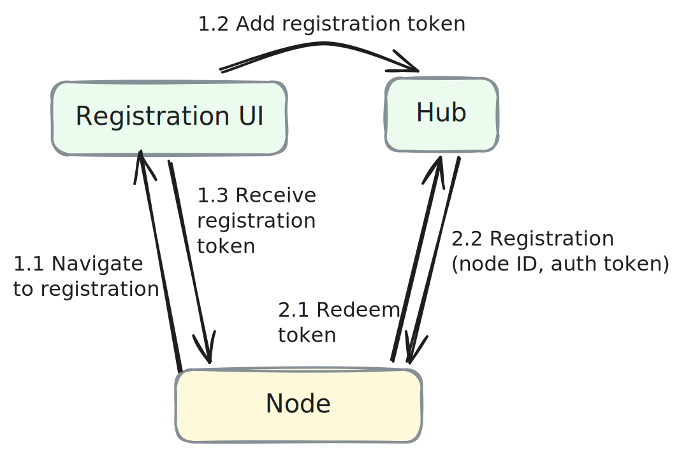
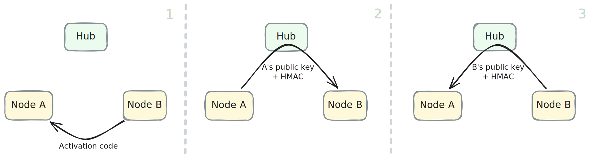
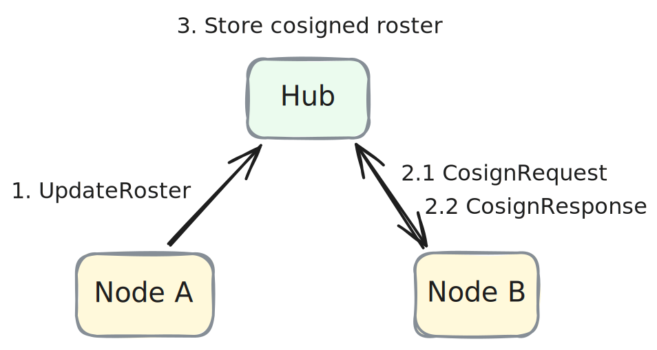
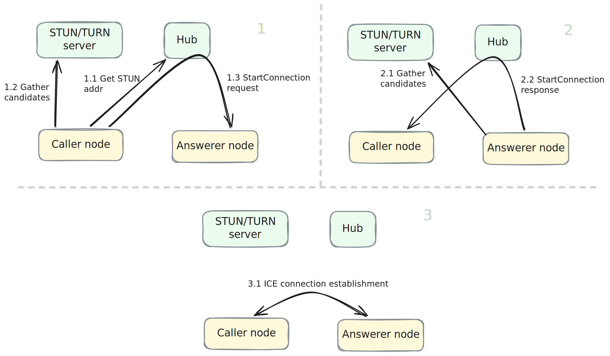
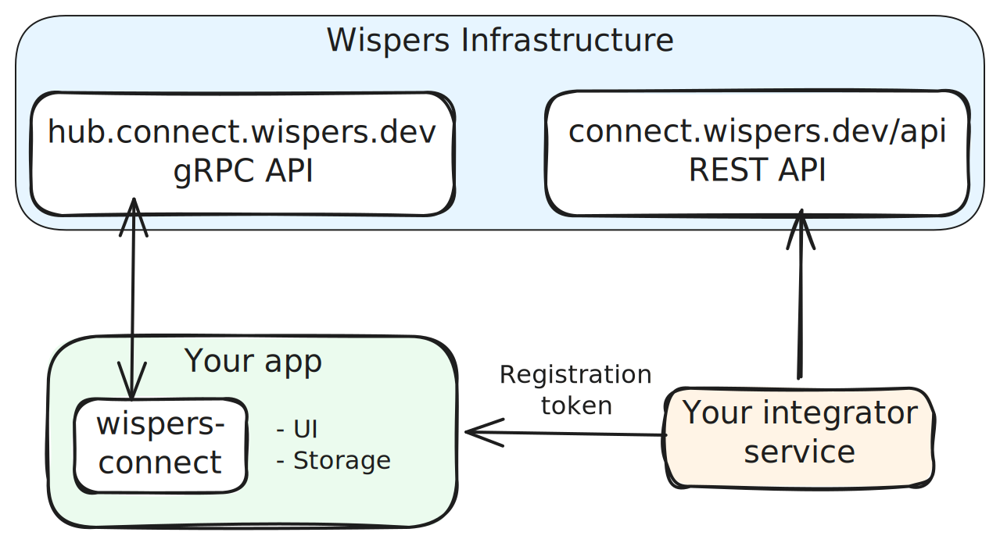

# How it works

This document explains the design of Wispers Connect: how nodes find each other,
how they establish trust, and how data moves between them. We'll first cover the
Wispers architecture, then expand to explain how Wispers Connect makes this
available to integrators (i.e. you).

## Wispers architecture

The basic architecture of Wispers consists of
* Nodes — the programs we want to communicate with each other
* Hub — the rendezvous server for NAT traversal
* Registration UI — here, users register their nodes. Usually a web UI, but
  could be many things

To give an idea how these work together, let's go through a few collaboration
diagrams.

### Node registration

The first thing is to add the nodes we want to communicate to a **connectivity
group**. What exactly a connectivity group corresponds to is use case
specific. In [Wispers Files](https://files.wispers.dev) for example, it
corresponds to a single user and their devices. With the `wconnect` tool's HTTP
proxying, it can mean all the devices having access to a proxied web app.

The sequence generally looks something like this:

  

1. In a first phase, we add all the necessary metadata about the node — name,
   user account, etc. Wispers stores this in a pre-registration and returns a
   registration token, which the UI returns to the node (using manual copying,
   deeplinks, or similar)
2. The node then sends this registration token to the Hub, which turns the
   pre-registration into an actual entry and returns (connectivity group ID,
   device number, auth token), which the node stores locally.

You may wonder why the two-phase registration is necessary. The reason is that
registration often involves things like browser logins, which is hard to do from
the node itself. If your use case can do everything at once, there's no need to
surface the two-phase registration to the user.

### Node activation

Once they are registered in a connectivity group, nodes in the same group can
exchange messages through the hub, but they still have to trust the hub to do
nothing nefarious. After all it's the classical man-in-the-middle we know from
IT security. Wispers fixes this with a process called "activation".

#### Pairing

The trick is to exchange a code between nodes without involving the Hub. This
could be a human copying the code manually between devices, scanning a QR code,
or anything to that effect. The nodes can then use this code to exchange their
respective public keys while being certain that the hub didn't tamper with them.

  

Each node computes an [HMAC](https://en.wikipedia.org/wiki/HMAC) from its public
key and the activation code. This proves to the receiver that the sender knew
the activation code and must be the peer node from the first step. The hub can't
fake this message because it doesn't know the code.

Once this procedure is complete, both nodes know each other's public keys, which
means that they can always verify that their messages weren't tampered
with. They can also use this to agree on an encryption key to make sure nobody
in-between can read what they send each other.

#### Updating the roster

Now that we have a way to pair nodes, we still run into the problem that this
quickly becomes onerous when the connectivity group grows. For 2 nodes, we need
one pairing; for 5 nodes we already need 10; for 10 nodes we need a full 45
pairings. Not fun.

To make this nicer, we add a second phase to the activation process, in which we
iteratively build up a cryptographic roster for the connectivity group. With
this roster, a node can use transitive trust — if node `n` trusts node `m`
because it's paired with it, and node `m` is also paired with _another_ node
`o`, `n` can also trust `o`. After each pairing, the nodes update the roster,
co-sign it, and store it in the Hub.

  

Nodes can verify this roster by following the history of its creation. Once a
node is paired with another, it can check the roster updates _that_ node has
co-signed and start trusting the nodes involved in those updates. Eventually
this will cover the entire roster. Again, the hub cannot interfere and just
stores the bytes.

#### Bootstrapping

Normally, activation involves a newly registered node (the "new node") and
another, already activated node (the "endorser") — but in a connectivity group,
nobody has been activated yet and the roster is empty. This is the bootstrap
problem. We can't just consider the first registered node magically activated
because the Hub could use this to trick nodes into trusting a fake first node.

Instead, we bootstrap the roster with the first pairing. Instead of updating the
existing roster, the nodes co-sign a newly initialised roster that contains just
the two of them. Any two of the registered nodes can do this.

### Establishing peer-to-peer connections

After activation, nodes that want to be reachable stay connected to the hub in
"serving" mode. In essence, they keep a bi-directional gRPC stream open and just
wait for the hub to send them requests to open connections to a peer node.

To open a connection to a serving node (the "answerer"), the "caller" node goes
through a NAT-traversal, relaying messages through the hub.

  

There are roughly 3 steps:

1. The caller gets the STUN/TURN config from the hub, gathers its own candidate
   addresses using that STUN server, generates its side of a Diffie-Hellman key
   exchange to establish encryption, and sends all of that to the answerer with
   a `StartConnection` request.
2. The answerer receives the message, gathers its own candidate addresses,
   generates its own side of the Diffie-Hellman key exchange, and sends all of
   that back.
3. Now both, caller and answerer, have all the information they need. They start
   ICE connection establishment using the embedded [libjuice
   library](https://github.com/paullouisageneau/libjuice) on both ends at the
   same time.

Once this is complete, both nodes can send each other UDP datagrams, encrypted
using the X25519 key established with the StartConnection request and response
messages.

Unfortunately, only a few applications work with UDP. Most want something like
TCP. Because of this, the nodes can also establish a QUIC connection on top of
the already established UDP path. QUIC is basically modernised TCP and
conveniently works on top of UDP. It also comes with TLS built in — which is a
challenge because this is geared towards public servers with TLS
certificates. Luckily, QUIC also supports pre-shared key (PSK) mode, and we have
just established a shared key! So in QUIC mode, Wispers does not encrypt the UDP
datagrams, but instead hands the key to QUIC to use it instead.

## Architecture overview

  

TODO
- Basic Wispers setup first. Nodes, Hub, Web UI. With sequence diagrams to explain the procedures (registration, activation, ICE & connection setup)
- Wispers Connect, how we make this available for integrators

<!-- TODO: diagram (mermaid) showing Hub, nodes, coturn, and the
     distinction between signaling (through Hub) and data (P2P).
     Source material: connect/DESIGN.md "Components" section. -->

## Node lifecycle

<!-- TODO: state diagram (mermaid) showing Pending -> Registered -> Activated.
     Explain what each state means and what operations are available.
     Source material: INTERNALS.md "Node State Machine" section. -->

## Registration

<!-- TODO: explain the integrator-driven registration flow.
     Token creation via REST API, OTP handoff to the node, completing
     registration with the Hub.
     Source material: connect/DESIGN.md "Node registration through an
     integrator" section. -->

## Activation & the roster

<!-- TODO: this is the core of the trust model. Cover:
     - What the roster is (protobuf with public keys, co-signed addenda)
     - Pairing: out-of-band secret, HMAC-based key exchange through Hub
     - Roster update: new node creates roster version, endorser co-signs
     - Bootstrap: first two nodes pair to create the initial roster
     - Transitive trust: every node trusts all others through the chain
     Source material: connect/DESIGN.md "Activation" section.
     Consider a mermaid sequence diagram for the pairing flow. -->

## Revocation

<!-- TODO: explain how any activated node can revoke any other.
     Cover the security trade-offs (single-revoker matches single-endorser).
     Source material: connect/DESIGN.md "Revocation" section. -->

## Peer-to-peer connections

<!-- TODO: explain connection setup. Cover:
     - ICE/STUN/TURN for NAT traversal (libjuice)
     - Signaling through the Hub (StartConnectionRequest/Response)
     - X25519 key exchange (currently derived from root key, not ephemeral)
     - Signature verification against the roster
     Source material: connect/DESIGN.md "Peer-to-peer connection setup"
     and INTERNALS.md "P2P Transport Architecture". -->

### UDP transport

<!-- TODO: raw UDP with AES-GCM encryption. When to use it
     (low-latency, loss-tolerant).
     Source material: INTERNALS.md "Transport Types" table. -->

### QUIC transport

<!-- TODO: reliable multiplexed streams over the ICE-established UDP path.
     TLS 1.3 PSK authentication (no certificates). When to use it.
     Source material: connect/DESIGN.md "QUIC setup" and
     INTERNALS.md "QUIC Authentication". -->

## Security properties

<!-- TODO: summarise the security guarantees:
     - End-to-end encryption (Hub cannot read data)
     - Roster-based trust (Hub cannot inject nodes)
     - Out-of-band activation codes (Hub never sees the secret)
     Also cover the known limitations:
     - No forward secrecy: X25519 keys are derived from root key, not
       ephemeral. Compromising the root key decrypts all past traffic.
       (See docs/connect/wispers-without-activation.md for future work notes.)
     - Compromised node can endorse malicious nodes
     - Compromised node can revoke legitimate nodes (DoS)
     Source material: connect/DESIGN.md "Security Considerations". -->
