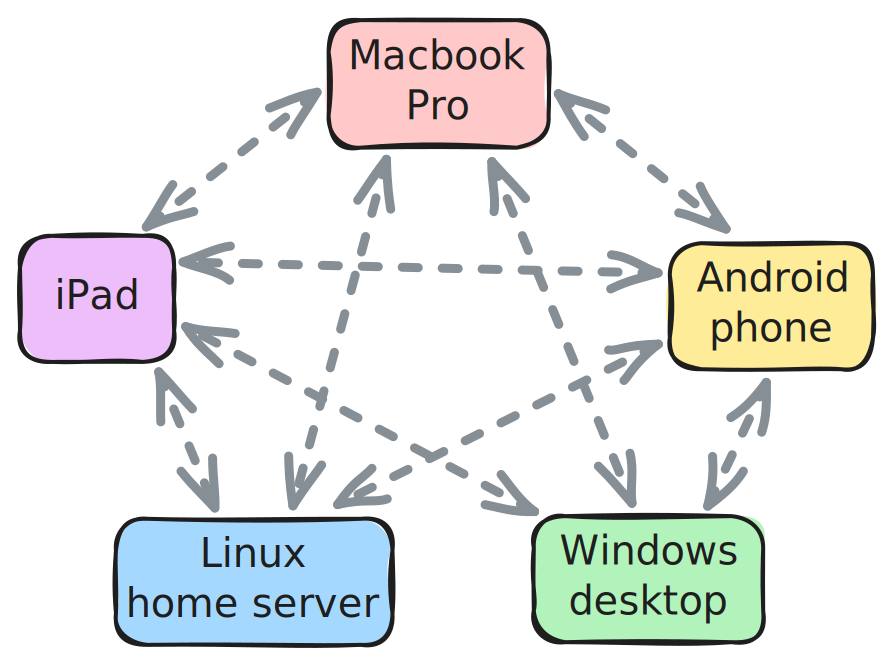
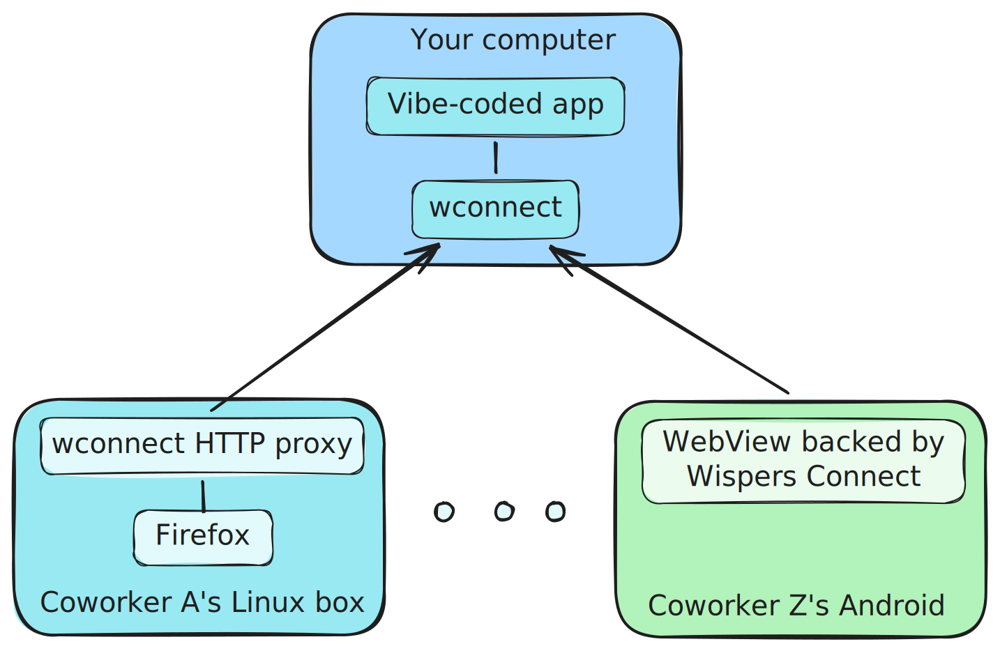
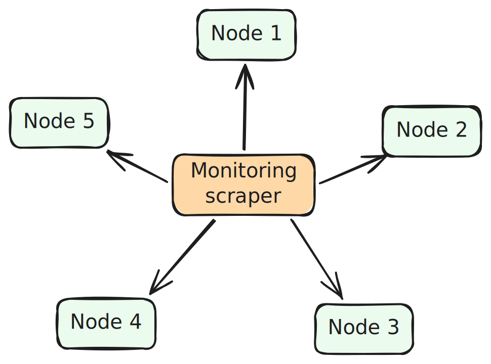

# How to use it

This guide shows how to integrate Wispers Connect into your application.

## Integration patterns

There are two main approaches:

* **Embed the library** — This gives you full control over the node lifecycle,
  serving, and peer-to-peer connections, and it lets you define the protocol on
  top of those peer-to-peer connections. This is the right choice if you're
  building your own software. The library is written in Rust and exposes a C
  FFI. Wrappers exist for Go, Kotlin/Android, Swift, and Python. See
  [Building](../README.md#building) for setup instructions.

* **Use wconnect as a sidecar** — The `wconnect` tool already implements some of
  the most popular and generic use cases of Wispers Connect — port forwarding
  and HTTP/SOCKS proxying. Run it as a sidecar process if you have an existing
  web app or TCP service and just want to make it reachable across devices.

## Configuring the Wispers Connect backends

Before the library and wconnect can do their work, you need to tell Wispers
about your use case.

### The Wispers Connect web app

To get started, you need at least one domain and an API key for it.

1. Get an account on https://connect.wispers.dev.
2. Choose a **domain**. You can think of domains as corresponding to use
   cases. For personal use and experimental projects, the automatically created
   "Default" domain is sufficient. If you're planning a new application based on
   Wispers Connect, you should probably give it its own domain.
3. Create at least one **API key** and note it down. You can always create new
   keys, but be careful with revoking them — if a production service relies on
   an API key, revoking it can cause the service to fail nearly instantly. The
   CLI tools accept API keys either as a CLI argument or as the environment
   variable `WC_API_KEY`.

### The REST API

Once you have an API key it's time to talk to the REST API, or use the `wcadm`
tool to do it for you. At this level, we're managing **connectivity groups** and
**node registration** (see [HOW_IT_WORKS.md](HOW_IT_WORKS.md) for a deeper
explanation of these concepts.

We don't go into details about `wcadm` in this doc because `wcadm help` is
clear enough and stays up-to-date.

There's a JSON description of the API at https://connect.wispers.dev/api that
should always be up to date with the latest details. Authentication is done with
your API as bearer token. Here's an overview of the most important bits of the
API:

#### Connectivity group management

* `GET /connectivity-groups` — List connectivity groups (limited to the domain
  matching the API key).
* `POST /connectivity-groups` — Create a connectivity group.\
  Parameters:
  * `name` — Optional, display name of the group
  * `associationKey` — Optional string, e.g. a user ID. Setting this prevents
	creating two groups with the same associationKey. Use this if you're
	associating an ID your side with the connectivity group.
* `DELETE /connectivity-groups/:id` — Delete a connectivity group and all its
  registered nodes.
* `POST /connectivity-groups/:id/reset` — Reset a connectivity group (remove all
  nodes, clear the roster).

#### Node management

* `GET /connectivity-groups/:id` — Get connectivity group state, including its
  nodes.
* `POST /connectivity-groups/:id/registration-tokens` — Create a registration
  token for a new node.\
  Parameters:
  * `nodeName` — Optional display name for the node.
  * `nodeMetadata` — Optional metadata (max 256 chars), in a format defined by
	yourself. JSON blobs work well here (e.g. `{"nodeType": "mobile"}`).
* `PATCH /connectivity-groups/:id/nodes/:nodeNumber` — Update a node.\
  Parameters:
  * `name` — New display name.

## Using the library

### Storage

A Wispers Connect node has very little state, but that state should get stored
securely. The library only comes with two built-in options, in-memory for
testing, and file-based for CLI tools. For everything else, you need to provide
your own implementation — either by implementing the `NodeStateStore` trait in
Rust, or by implementing the equivalent FFI storage callbacks from a wrapper
language. If possible, you'll want to use your platform's secure storage, like
for example the macOS Keychain.

The Kotlin wrapper implementation contains an example: See
`/wrappers/kotlin/src/main/kotlin/dev/wispers/connect/storage`

### Node lifecycle

The main object you'll deal with is the `Node`. It can be in various lifecycle
states: "pending", "registered", "activated". The typical flow to get a Node up
and running is this:

1. Instantiate a `NodeStorage` object using your storage implementation, then
   call `restore_or_init_node()` on it. This will read the state from storage
   (or if that's empty, initialise it as "pending") and return a Node.
2. Get the Node into the "activated" state.
   * If the Node is "pending", get a registration token and call
	 `node.register(token)`
   * If the Node is "registered", get an activation code and call
	 `node.activate(code)`
3. Once the node is activated (check `node.state()`), it's fully functional. You
   can
   * `start_serving()` to wait for other nodes to open connections to this one
   * `connect_quic()` or `connect_udp()` to open a peer-to-peer connection to
	 another node
   * Query `group_info()` to get the state of all nodes in the connectivity
	 group

If you need to reset a node, you can also call `logout()`. This will revoke the
node's entry from the roster and deregister the node from the hub.

To understand what the different node states really mean, check out the
explanation in [HOW_IT_WORKS.md](HOW_IT_WORKS.md).

### Serving

For a node to be reachable it has to be "serving". That is, it has to be
connected to the hub and wait for connection requests. Call
`node.start_serving()` to kick this off. You get back three objects:

* The `ServingSession` is the runner. Note that you _have to run it_ for things
  to work, for example with `tokio::spawn(session.run())` if you're using the
  Rust interface directly.
* The `ServingHandle` lets you talk to the running serving session (`status()`,
  `generate_activation_code()`, `shutdown()`).
* The `IncomingConnections` object lets you handle connections from peer nodes.
  The Rust interface provides the channels `udp` and `quic` for this purpose,
  giving you `UdpConnection` and `QuicConnection` objects, respectively.

What to do with incoming connections is entirely up to you. You can design any
protocol you like.

### Opening connections

To connect to another node, call `node.connect_quic(target_node)` or
`node.connect_udp(target_node)`, depending on what you need. Most people will
want the QUIC variant.

Once a connection was established, it's your turn to run your app-specific
protocol. Some options:

* A good old line-oriented protocol like SMTP or FTP.
* Varint length prefix, followed by protobuf requests. You get all the nice
  forward- and backward compatibility of protocol buffers, but wire format
  protocol buffers are harder to debug.
* Send and receive JSON objects. This lies somewhere between the first two
  options.

### Error handling

Sometimes, things will go awry. Here's how to deal with some common scenarios:

* State-inappropriate operations (InvalidState) — This happens if you use Node
  methods that don't match the node's current state. For example, if your node
  is "pending" or "registered", it can't open connections yet. Make sure your
  node goes through the appropriate stages of the lifecycle.

* Invalid activation code — This happens during activation. Either the user made
  a mistake when entering the activation code, or the code has expired. Prompt
  the user to retry.

* Peer rejected / unavailable — You've tried to contact a peer that doesn't
  exist (rejected) or currently isn't connected to the hub (unavailable). In the
  latter case, you can either tell the user or somehow wake up the peer first
  (Wispers Files does this using Firebase Cloud Messaging).

* Hub unreachable — Either the network between the node and the Wispers hub is
  having problems, or the hub itself is down. Please follow the usual retrying
  best practices (i.e. don't retry-spam us, thank you!)

* Unauthenticated (node removed server-side) — This happens if the current node
  has been revoked and removed from its connectivity group, or the connectivity
  group itself has gone away. You should clear local state (logout) and restart
  the node lifecycle.

## Using wconnect as a sidecar

If you can't embed the wispers-connect library in your software, you can still
teach your software to communicate through Wispers using the `wconnect` tool.

### The server side

The general pattern is to run `wconnect serve` next to a server and allow
port-forwarding from remote Wispers nodes. There are several options:

* `wconnect serve --allow-port-forwarding` — Allow remote Wispers nodes to
  connect to _any_ port on the local host.
* `wconnect serve --allow-port-forwarding=42,4711` — Allow remote Wispers nodes
  to connect only to ports 42 and 4711 on the local host.

If you can't run `wconnect` on the same host as the server you want to reach,
you can also use the argument `--allow-egress` to allow connecting to an address
(and port) that's on a different host. This can be quite useful together with
the proxy-http and proxy-socks commands.

By default, `wconnect serve` stays in the foreground and logs activity to the
terminal. You can also start it with the `--daemon` flag (or just `-d`) to make
it run in the background. Run `wconnect serve --stop` to stop the background job
again.

### The client side

On the client side, you have a few options to connect to the server we've hooked
up to Wispers using `wconnect`:

* `wconnect forward <LOCAL_PORT> <NODE> <REMOTE_PORT>` gives you simple port
  forwarding. Connections to the local port get forwarded to the given node
  number and remote port.
* `wconnect proxy-http` starts an HTTP CONNECT proxy that makes all nodes in the
  connectivity group reachable under hostname `<node_number>.wispers.link`. If a
  peer node allows egress traffic, you can also use that node to make HTTP
  requests to arbitrary hosts that are reachable from that node — great for
  accessing the Internet as if you were somewhere else. By default, the proxy
  listens on port 8080, but you can change this with the `--bind` flag.
* `wconnect proxy-socks` works similar to the HTTP variant but starts a SOCKS5
  proxy instead. This allows you to connect more things than just web browsers
  and web servers.

## Example use cases

There are many things you can do with Wispers Connect. Here are a few examples
to get the inspiration going.

### Wispers Files, a peer-to-peer network of your personal devices

[Wispers Files](https://files.wispers.dev) (currently in open beta) is a great
example of the multi-platform capabilities of Wispers Connect. It lets you
connect your personal devices into a little cloud of your own (a wisp of a cloud
if you will).

  

Files is focused on sending files directly between devices (the author wanted an
efficient way to transfer RAW files) but the design could be used for any kind
of data — remote desktop sessions, a universal clipboard, passwords and API
keys, etc.

### Securely share your vibe-coded app with coworkers

Vibe coding made it dramatically easier to create a custom-tailored app for your
internal business process. But when it's time to share it with coworkers, the
default is to put it on the public internet. At the same time, the single
biggest thing you can do to secure your app is *not* to put it on the public
internet.

Wispers resolves the contradiction. Just run the app on a computer you control,
connect it to Wispers using the `wconnect` sidecar, then add your coworker's
devices into a connectivity group for that app. Now they can access your app
even if their devices aren't on your intranet, like their smartphones, but
nobody else can!

  

The software that ships with Wispers Connect can already do this today, although not very ergonomically. `wconnect` can be used for port forwarding and HTTP proxying, and the Android example app implements the WebView approach. Also, almost all vibe-coding platforms allow you run your app locally.

### Monitoring devices across several intranets and VPNs

If you're responsible for software running on devices inside networks you don't
control, monitoring can be a headache. Almost the only sane solution is to have
all devices connect to a cloud service and wait proactively send monitoring
data, but that goes against the grain of monitoring solutions like Prometheus
and it's a headache for data sovereignty.

If you connect your devices with Wispers, the standard approach of scraping
monitoring variables becomes easy. Just open a QUIC connection to the node and
send the monitoring requests through that. Your data stays fully under your
control.

  

Depending on your case, you can implement this in different ways. If your
software runs on a server, it may be easiest to run a `wconnect` sidecar to
port-forward the requests. If it's an embedded app, making your software
reachable by using the wispers-connect library is probably a better choice.
